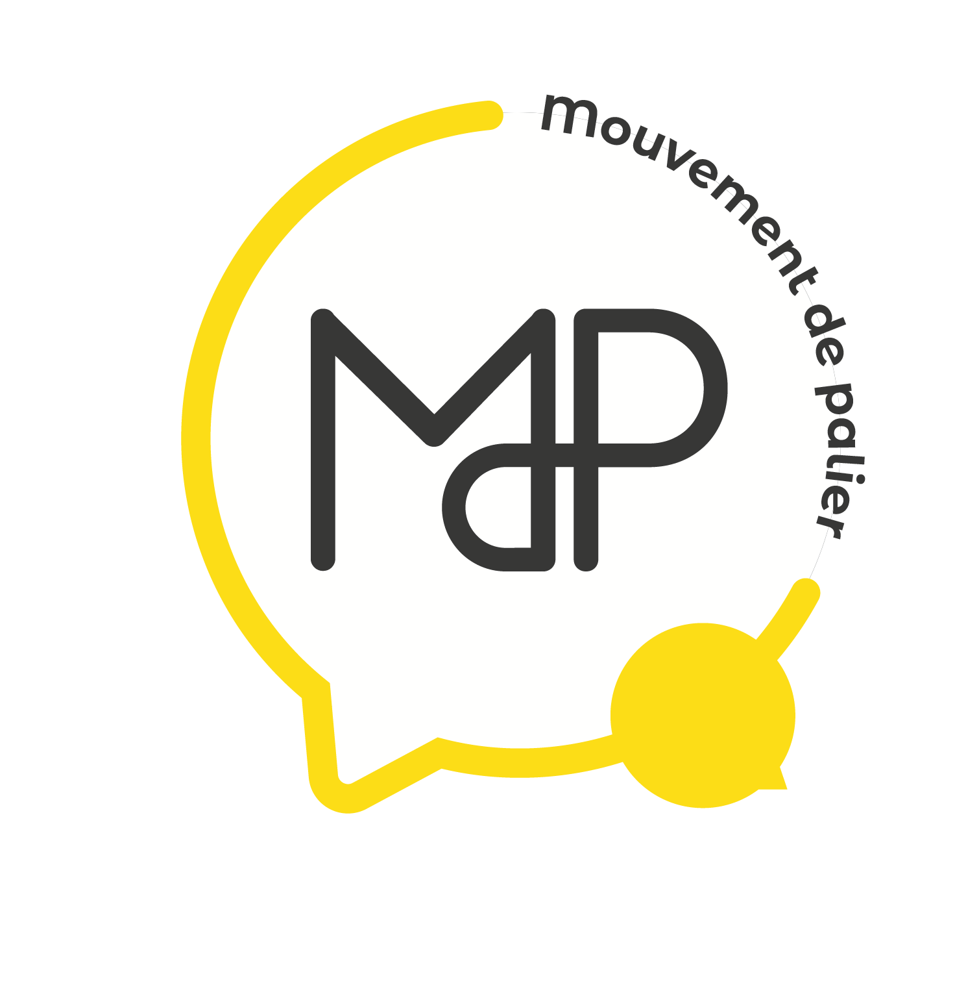

# Mets ta poubelle au régime

L'application du défi "Mets ta poubelle au régime" de [Mouvement de palier](https://www.mouvementdepalier.fr/)

L'application "Défi Mets ta poubelle au régime" est destinée aux participant.es du défi Mets ta poubelle au régime. Elle a pour but d'accompagner les participant.e.s à évaluer et mesurer le contenu de leurs poubelles, de suivre les thématiques abordées par le biais de quiz et de se donner des mini-défis personnels et d'équipe. Cette application permet également d'animer les rencontres d'équipes !
Grâce a toutes les informations vous aurez la possibilité de connaitre vos avancées !

*L'application est en version bêta pour le défi 2023*

## Téléchargement
Disponible sur Android uniquement pour le moment.

*Pour la télécharger :*
https://play.google.com/store/apps/details?id=com.mouvement_de_palier.mets_ta_poubelle_au_regime

## Note sur le contenu de l'application
Le contenu n'est volontairement pas disponible sur le repo publique !

